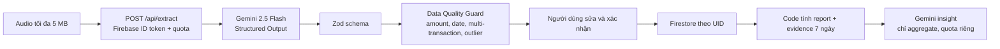

# Kiến trúc AI/ML — Sổ Chợ AI

## Ranh giới tin cậy

- Audio và nội dung nói là dữ liệu không tin cậy; chúng không thể đổi prompt, gọi tool hay ghi dữ liệu.
- Gemini chỉ trả draft; không có quyền Firestore.
- Zod và Data Quality Guard chạy server-side trước màn hình xác nhận.
- Chỉ thao tác xác nhận của người dùng mới ghi transaction.
- Insight chỉ nhận aggregate do code tính. Không gửi raw transaction, UID, audio hay transcript riêng tư.

## Bằng chứng chất lượng

- Evaluation text: 60 mẫu project-authored, nhãn khóa trước khi gọi model.
- Report public chỉ được sinh bằng `publish-text-report.mjs`; script từ chối fixture.
- Model/prompt/timestamp, field metrics, nhóm lỗi và ví dụ đúng/sai/guard được hiển thị trong AI Quality Lab.
- Voice benchmark tách riêng khỏi text benchmark và chỉ công bố khi có audio synthetic/public hợp lệ.
